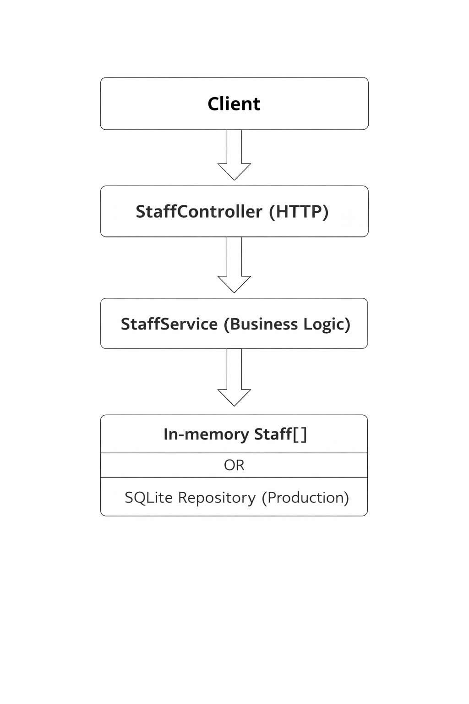
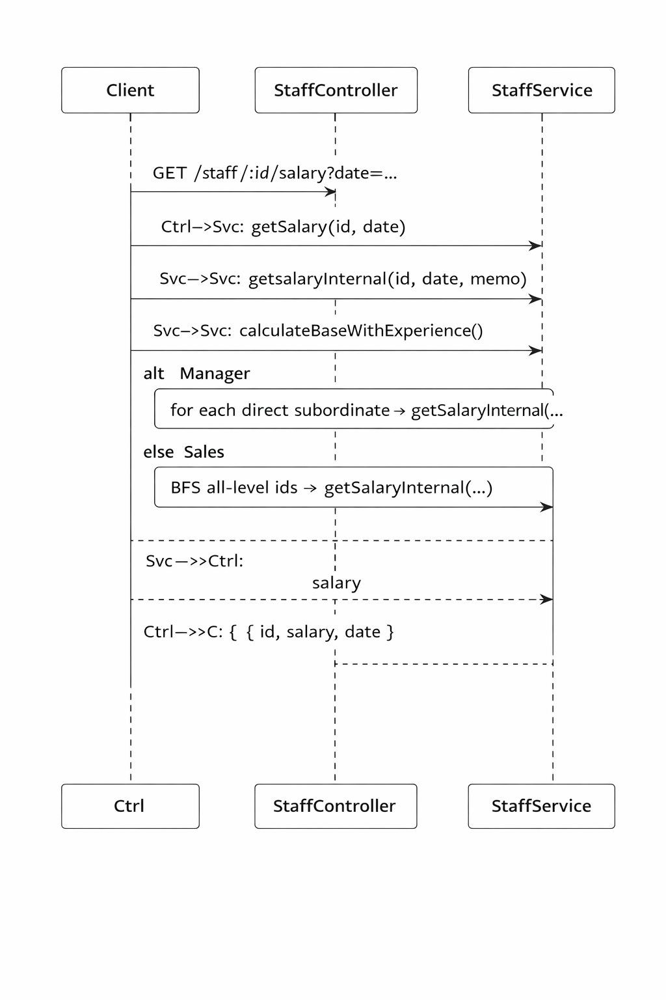
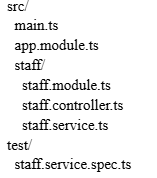

**Technical Design Document (TDD)**  
**Test Assignment Solution**

# **Executive Summary**

This document describes the architecture and implementation of a NestJS service that calculates staff salaries for an arbitrary date. Salary rules depend on staff type (Employee/Manager/Sales), full years of service (capped), and organizational hierarchy bonuses. The reference implementation uses a transient in-memory data model (as allowed by the assignment). A production-ready approach using SQLite is also described.

# **1\. Problem Statement**

Implement salary calculation for company staff members. Each staff member has: name, join date, base salary, type, and an optional supervisor. The system must calculate an individual salary for a given date and compute the total salary sum for the whole company.

# **2\. Business Rules**

| Type | Seniority rate | Cap | Hierarchy bonus |
| :---- | :---- | :---- | :---- |
| Employee | 3% per full year | 30% | None |
| Manager | 5% per full year | 40% | \+0.5% of each DIRECT subordinate’s FULL salary |
| Sales | 1% per full year | 35% | \+0.3% of each ALL-LEVEL subordinate’s FULL salary |

Important: hierarchy bonuses are calculated from subordinates’ FULL salaries (including their own hierarchy bonuses), not just base \+ experience.

# **3\. API Specification (as implemented)**

| Method | Path | Query | Response (shape) |
| :---- | :---- | :---- | :---- |
| GET | /staff/:id/salary | date=YYYY-MM-DD (optional) | { id, salary, date } |
| GET | /staff/total-salary | date=YYYY-MM-DD (optional) | { total, date } |

Example requests:

curl "http://localhost:3000/staff/2/salary?date=2025-01-01"

curl "http://localhost:3000/staff/total-salary?date=2025-01-01"

## **3.1 Error Handling (as implemented)**

| Case | HTTP status | Notes |
| :---- | :---- | :---- |
| Invalid id (non-numeric) | 400 Bad Request | Validated in StaffController (Number.isFinite check) |
| Invalid date format (date=abc) | 400 Bad Request | Validated in controller; service also validates date |
| Staff id not found | 200 OK (salary=0) | Current service returns 0; production API should return 404 |

# **4\. Architecture**

The solution follows a small layered architecture typical for NestJS services:

• Controller layer: parses request params (id/date), validates inputs, calls the service, shapes the response.

• Service layer: business logic (salary rules), hierarchy traversal (direct / all-level), recursive salary computation.

• Storage layer: transient in-memory array (allowed by assignment).

## **4.1 Component Diagram**

## **4.2 Sequence Diagram (Mermaid)**

# **4.3  Salary Calculation Logic Flow**

 

# **5\. Data Model**

Transient model (in-memory):

| Field | Description |
| :---- | :---- |
| id | Unique identifier |
| name | Person name |
| type | Employee | Manager | Sales |
| joinedDate | Employment start date |
| baseSalary | Base salary amount (number) |
| supervisorId | Optional supervisor reference (adjacency list model) |

## **5.1 SQLite ER Model (Proposed)**

Proposed SQLite schema (adjacency list):  
CREATE TABLE staff (  
  id            INTEGER PRIMARY KEY,  
  name          TEXT NOT NULL,  
  type          TEXT NOT NULL CHECK (type IN ('Employee','Manager','Sales')),  
  joined\_date   TEXT NOT NULL, \-- ISO date  
  base\_salary   INTEGER NOT NULL, \-- store cents in production  
  supervisor\_id INTEGER,  
  FOREIGN KEY (supervisor\_id) REFERENCES staff(id)  
);

CREATE INDEX idx\_staff\_supervisor\_id ON staff(supervisor\_id);

# **6\. Salary Calculation Algorithm**

## **6.1 Full Years of Service**

Years are counted as FULL years between joinedDate and the target date, using an anniversary-based approach:  
• years \= date.year − joinedDate.year  
• if date is before the anniversary in date.year, then years \-= 1  
• clamp years to \>= 0

## **6.2 Seniority Bonus**

Base with experience formula (no subordinate bonuses):

**baseWithExperience \= baseSalary \* (1 \+ min(years \* rate, cap))**

## **6.3 Hierarchy Bonuses**

Manager bonus: \+0.5% of each DIRECT subordinate’s FULL salary.  
Sales bonus: \+0.3% of each ALL-LEVEL subordinate’s FULL salary.  
Because bonuses depend on subordinate FULL salaries, the service calls getSalary() recursively.

# **7\. Implementation Details**

## **7.1 Subordinate Traversal for Sales**

Sales bonuses require ALL-LEVEL subordinates. The implementation uses an iterative breadth-first search (BFS) starting from the Sales person id. Each discovered child is added to the list and also pushed into the queue for further exploration.

Note: the current BFS does not include a 'visited' set. If hierarchy data accidentally contains cycles, the BFS can loop indefinitely. A production improvement is to add cycle protection (visited-set) and validate supervisor assignments on write.

## **7.2 Complexity**

Let N be the number of staff members.  
• Single salary calculation is O(size of the subordinate subtree) due to recursive calls.  
• Company total salary can trigger repeated recalculations of the same subtrees. In the worst case this may approach O(N^2) for larger hierarchies.  
Production improvement: add memoization per request date to compute each salary once (reducing total complexity to \~O(N)).

## **7.3 Numeric Precision**

The implementation uses JavaScript numbers and rounds to 2 decimals. For production payroll calculations, store monetary values as integer cents or use a decimal library to avoid floating-point drift.

## **7.4 Date Formatting / Timezone**

The API returns \`date\` as an ISO date string (YYYY-MM-DD) derived from \`toISOString()\`. This is stable across environments. A production note is to define whether the system uses UTC or local timezone for payroll cutoffs.

# **8\. Testing**

Unit tests (Jest) should cover:  
• seniority caps (Employee 30%, Manager 40%, Sales 35%)  
• Manager direct-only bonus (0.5% from direct subordinates)  
• Sales all-level bonus (0.3% from full subtree)  
• edge cases: invalid date (400), date before joinedDate (0), anniversary boundary  
• regression: hierarchy bonuses computed from FULL subordinate salaries

# **9\. Installation & Runbook**

Commands:  
npm install  
npm run test  
npm run start

Server listens on port 3000 by default.

## **9.1 Project Structure (core files)**

# **10\. Advantages / Drawbacks / Improvements**

## **10.1 Advantages**

• Clear separation of concerns (Controller vs Service).

• Deterministic salary calculation for an arbitrary date.

• Correct hierarchy bonus calculation based on FULL subordinate salaries (via recursive calls).

• Readable and straightforward implementation appropriate for a small test assignment.

## **10.2 Drawbacks (current implementation)**

• Transient storage (in-memory) — data is lost after restart.

• Repeated recalculations may reduce performance for large hierarchies (no memoization).

• No cycle guard in Sales BFS traversal (can loop indefinitely if data contains a cycle).

• Floating-point arithmetic is not ideal for production payroll.

• Recursive salary calculation can hit call stack limits for extremely deep hierarchies.

## **10.3 Production Improvements**

• Use SQLite/PostgreSQL with an ORM (TypeORM/Prisma), migrations, and indexes.

• Introduce DTOs \+ class-validator \+ global ValidationPipe for strict inputs.

• Return 404 for unknown staff (instead of salary=0) and keep error semantics consistent.

• Store monetary values as integer cents (or use decimal library) and standardize rounding rules.

• Add cycle protection (visited-set) and validate supervisor assignments at write-time.

• Add Swagger/OpenAPI docs and e2e tests (Supertest).